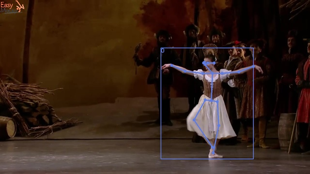

# MotionSnap

**MotionSnap** is a full-stack web application for managing and processing videos using [EasyMocap librabry](https://chingswy.github.io/easymocap-public-doc/quickstart/quickstart.html).  
It allows users to upload videos, view them in a paginated list, and organize or process video data through a FastAPI backend and a modern ReactJS frontend.

## Pose Extraction Visualization

<p align="center">
  
  
</p>

<p align="center">
  
</p>

<p align="center">
  <em>Original → 2D Pose Estimation → 3D Pose Visualization</em>
</p>

> **Note:** Only support 1view-1person video.

---

## 🚀 Features

- Upload and store videos locally.  
- Display paginated video lists with thumbnails and metadata.  
- View video details and status.  
- Organized architecture separating frontend, backend, and storage.  
- Ready for future extensions like AI-based video analysis or cloud storage.

---

## 🏗️ Tech Stack

| Layer | Technology |
|-------|-------------|
| **Frontend** | React, TypeScript |
| **Backend** | FastAPI (Python 3.10+) |
| **Database** | PostgreSQL |
| **Storage** | Local file system (`/storage` folder) |

---

## 📁 Project Structure

```bash
motion-snap/
├── backend/
│   ├── EasyMocap/
│   ├── auth/
│   │   ├── constants.py
│   │   ├── dependencies.py
│   │   ├── models.py
│   │   ├── schemas.py
│   │   ├── services.py
│   │   ├── router.py
│   │   └── utils.py
│   │   ...
│   ├── videos/
│   │   ├── constants.py
│   │   ├── dependencies.py
│   │   ├── models.py
│   │   ├── schemas.py
│   │   ├── services.py
│   │   ├── router.py
│   │   ├── utils.py
│   │   ...
│   ├── storage/
│   │   ├──inputs
│   │       └──{video_id}
│   │   ├──outputs
│   │       └──{video_id}
│   └── requirements.txt
│
├── frontend/
│   ├── src/
│   │   ├── components/
│   │   ├── pages/
│   │   ├── services/
│   │   ├── styles/
│   │   ...
│   └── package.json
│
├── installation.md
└── README.md
```
## Setup instruction

### Prerequisites
Before starting, make sure you have installed:

- **Python 3.10+**  
- **Node.js**  
- **Docker**  

### Backend
This project uses EasyMocap for pose extraction.
Please follow the instructions in installation.md to set up EasyMocap properly before running any pose-related endpoints.

Create a .env file in BE/ with the following content:
```bash
SECRET_KEY=your_secret_key
DB_USER=your_db_user
DB_PASSWORD=your_db_password
DB_HOST=localhost
DB_PORT=5432
DB_NAME=your_db_name
```
Make sure to replace the placeholder values with your actual credentials.

Start server:
```bash
cd BE
python3 -m venv venv
source venv/bin/activate
pip install -r requirements.txt
uvicorn app.main:app --reload
```
Access the API at: http://localhost:8000

### Frontend
```bash
cd FE
npm install
npm run dev
```
Then open http://localhost:5173/
