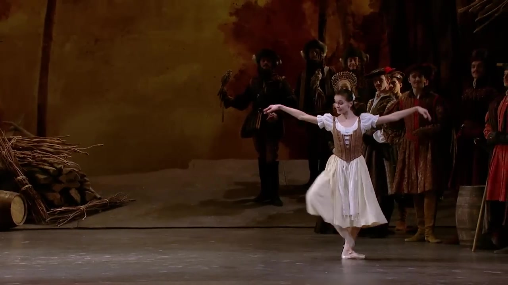
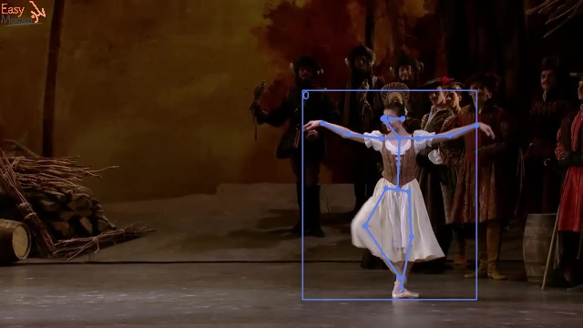
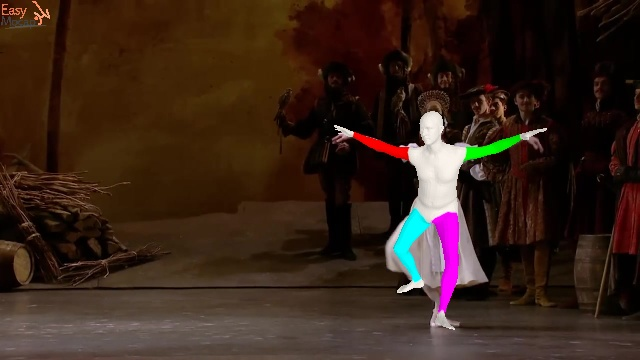

# MotionSnap

**MotionSnap** is a full-stack web application for managing and processing videos using [EasyMocap librabry](https://chingswy.github.io/easymocap-public-doc/quickstart/quickstart.html).  
It allows users to upload videos, view them in a paginated list, and organize or process video data through a FastAPI backend and a modern ReactJS frontend.

## Pose Extraction Visualization

<div align="center" style="display: flex; justify-content: space-between; gap: 10px;">
  
  
  
</div>

<p align="center">
  <em>Original → 2D Pose Estimation → 3D Pose Visualization</em>
</p>
> **Note:** Only support 1view-1person video.

---

## Features

*   **Video Management**: Upload, store, and manage videos locally with ease.
*   **Pose Extraction**: Automatically extract 2D and 3D poses from uploaded footage, [Mono_mocap](https://github.com/thanh094118/Mono_mocap) by [@thanh094118](https://github.com/thanh094118) is used for 3D pose visualization.
*   **Visualization dashboard**: View processed videos, extracted poses.
*   **Direct Mobile Upload**: Integrated support for uploading frames directly from Android devices via [Multiple camera remote](https://github.com/ntth2000/multiple-camera-remote) (forked from [@tranbadat](https://github.com/tranbadat)).
*   **Scalable Architecture**: Clean separation between Frontend, Backend, and Storage services.

---

## Tech Stack

### Frontend
*   **Framework**: [React 19](https://react.dev/)
*   **Build Tool**: [Vite](https://vitejs.dev/)
*   **Language**: TypeScript
*   **UI Library**: [Ant Design](https://ant.design/)
*   **Styling**: [TailwindCSS](https://tailwindcss.com/)
*   **Networking**: Axios

### Backend
*   **Framework**: [FastAPI](https://fastapi.tiangolo.com/) (Python 3.10+)
*   **Database**: PostgreSQL
*   **ORM**: SQLAlchemy & Verify with Pydantic
*   **Video Processing**: EasyMocap, OpenCV, MoviePy
*   **Authentication**: PyJWT

---

## Project Structure

```bash
motion-snap/
├── backend/
│   ├── EasyMocap/
│   ├── auth/
│   │   ├── constants.py
│   │   ├── dependencies.py
│   │   ├── models.py
│   │   ├── schemas.py
│   │   ├── services.py
│   │   ├── router.py
│   │   └── utils.py
│   │   ...
│   ├── storage/
│   │   ├──inputs
│   │       └──{video_id}
│   │   ├──outputs
│   │       └──{video_id}
│   └── requirements.txt
│
├── frontend/
│   ├── src/
│   │   ├── components/
│   │   ├── pages/
│   │   ├── services/
│   │   ├── styles/
│   │   ...
│   └── package.json
│
├── installation.md
└── README.md
```

---

## Installation & Setup

### Prerequisites
Before starting, make sure you have installed:

- **Python 3.10+**  
- **Node.js**  
- **Docker**  

### Backend
This project uses EasyMocap for pose extraction.
Please follow the instructions in installation.md to set up EasyMocap properly before running any pose-related endpoints.

Create a .env file in BE/ with the following content:
    ```bash
    pip install -r requirements.txt
    ```

4.  Configure Environment Variables:
    Create a `.env` file in `BE/` and add your database and app credentials:
    ```env
    SECRET_KEY=your_secure_secret_key
    
    # Database Configuration
    DB_USER=your_db_user
    DB_PASSWORD=your_db_password
    DB_HOST=localhost
    DB_PORT=5432
    DB_NAME=your_db_name
    
    # Admin Setup (Optional)
    ADMIN_EMAIL=admin@example.com
    ADMIN_PASSWORD=admin_password
    ```

5.  Start the Backend Server:
    ```bash
    cd BE
    python3 -m venv venv
    source venv/bin/activate
    pip install -r requirements.txt
    uvicorn app.main:app --reload
    ```
    The API will be available at `http://localhost:8000`.

### Frontend Setup

1.  Navigate to the frontend directory:
    ```bash
    cd FE
    ```

2.  Install dependencies:
    ```bash
    npm install
    ```

3.  Configure Environment Variables:
    Create a `.env` file in `FE/`:
    ```env
    VITE_API_URL=http://localhost:8000/api
    ```

4.  Start the Development Server:
    ```bash
    npm run dev
    ```
    Access the application at `http://localhost:5173`.

---

## Key API Endpoints

| Method | Endpoint | Description |
| :--- | :--- | :--- |
| `POST` | `/upload` | Upload a video and extract frames. |
| `POST` | `/extract_poses/{video_id}` | Extract 2D and 3D poses using EasyMocap. |
| `POST` | `/draw_3d/{video_id}` | Generate and save 3D pose visualization. |
| `GET` | `/{video_id}/extracted_poses` | Retrieve 2D pose data, frames, and video info. |
| `GET` | `/{video_id}/drawn_3d` | Retrieve 3D pose data, visualizations, and outputs. |

For full API documentation, visit `http://localhost:8000/docs` while the backend is running.