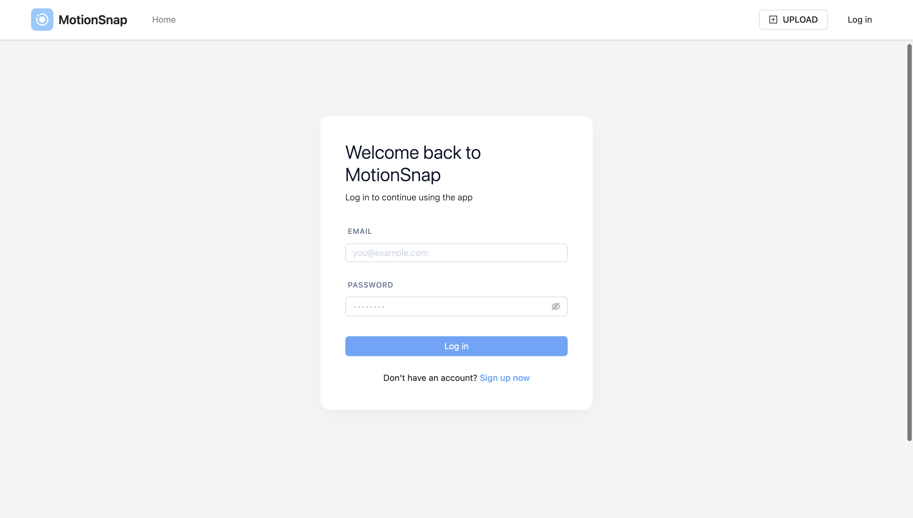
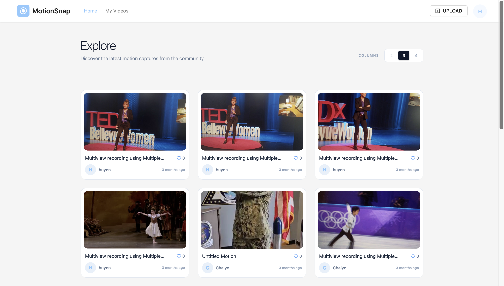
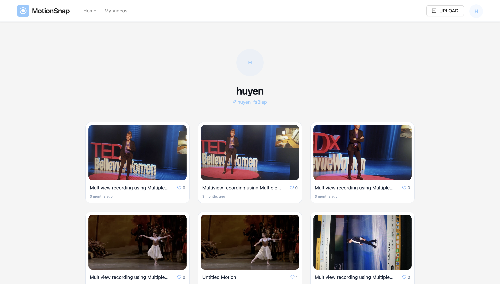
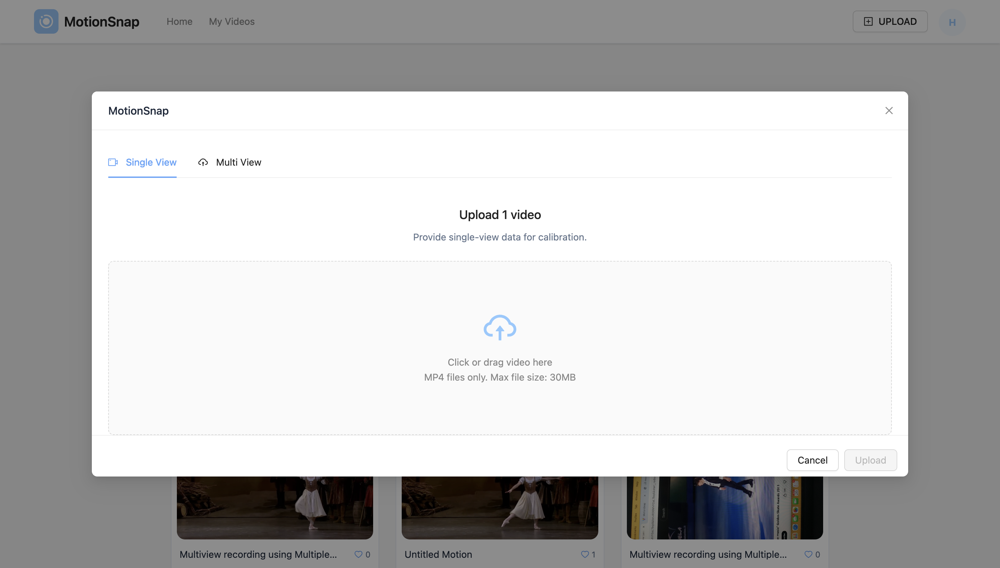
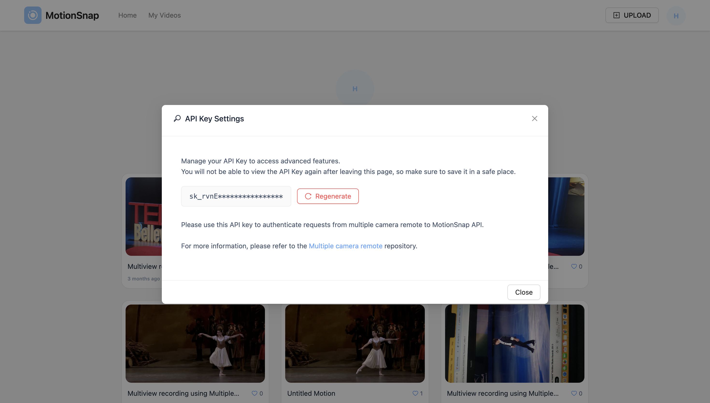
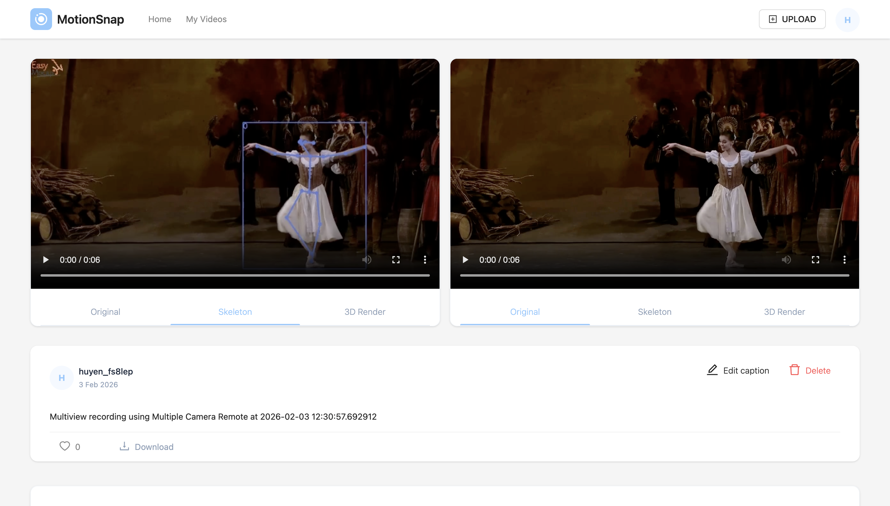

# MotionSnap

**MotionSnap** is a full-stack school's project for video management and human pose extraction using [EasyMocap library](https://chingswy.github.io/easymocap-public-doc/quickstart/quickstart.html). The application enables users to upload videos or capture frames directly from a companion mobile app, then automatically extracts and visualizes 2D skeleton poses and 3D mesh reconstructions through a FastAPI backend and modern ReactJS frontend.

## Pose Extraction Visualization

<div align="center" style="display: flex; justify-content: space-between; gap: 10px;">
  
  
  
</div>

<p align="center">
  <em>Original → 2D Pose Estimation → 3D Pose Visualization</em>
</p>
> **Note:** Only support 1view-1person video.

---

## Application Screenshots

<div align="center" style="display: grid; grid-template-columns: repeat(3, 1fr); gap: 15px; margin: 20px 0;">
  <div>
    
    <p><em>Login Screen</em></p>
  </div>
  <div>
    
    <p><em>Home Screen</em></p>
  </div>
  <div>
    
    <p><em>Profile Screen</em></p>
  </div>
  <div>
    
    <p><em>Upload Screen</em></p>
  </div>
  <div>
    
    <p><em>Generate Key Screen</em></p>
  </div>
  <div>
    
    <p><em>View Post Screen</em></p>
  </div>
</div>

---

## Features

*   **Video Management**: Upload, store, and manage videos locally.
*   **Pose Extraction**: Automatically extract 2D skeleton poses and 3D mesh reconstructions from uploaded footage using EasyMocap. [Mono_mocap](https://github.com/thanh094118/Mono_mocap) by [@thanh094118](https://github.com/thanh094118) is used for 3D pose visualization.
*   **Dual Visualization**: View both 2D skeleton key-points and 3D mesh poses with interactive dashboards.
*   **Direct Mobile Frame Upload**: Capture and upload frames directly from a custom Android companion app via [Multiple camera remote](https://github.com/ntth2000/multiple-camera-remote) (forked from [@tranbadat](https://github.com/tranbadat)), secured with authentication keys.

---

## Tech Stack

### Frontend
*   **Framework**: [React 19](https://react.dev/)
*   **Build Tool**: [Vite](https://vitejs.dev/)
*   **Language**: TypeScript
*   **UI Library**: [Ant Design](https://ant.design/)
*   **Styling**: [TailwindCSS](https://tailwindcss.com/)
*   **Networking**: Axios

### Backend
*   **Framework**: [FastAPI](https://fastapi.tiangolo.com/) (Python 3.10+)
*   **Database**: PostgreSQL
*   **ORM**: SQLAlchemy & Verify with Pydantic
*   **Video Processing**: EasyMocap, OpenCV, MoviePy
*   **Authentication**: PyJWT

---

## Project Structure

```bash
motion-snap/
├── backend/
│   ├── EasyMocap/
│   ├── auth/
│   │   ├── constants.py
│   │   ├── dependencies.py
│   │   ├── models.py
│   │   ├── schemas.py
│   │   ├── services.py
│   │   ├── router.py
│   │   └── utils.py
│   │   ...
│   ├── storage/
│   │   ├──inputs
│   │       └──{video_id}
│   │   ├──outputs
│   │       └──{video_id}
│   └── requirements.txt
│
├── frontend/
│   ├── src/
│   │   ├── components/
│   │   ├── pages/
│   │   ├── services/
│   │   ├── styles/
│   │   ...
│   └── package.json
│
├── installation.md
└── README.md
```

---

## Installation & Setup

### Prerequisites
Before starting, make sure you have installed:

- **Python 3.10+**  
- **Node.js**  
- **Docker**  

### Backend
This project uses EasyMocap for pose extraction. Before running the backend, you must build and run the EasyMocap Docker container.

**1. Build and Run EasyMocap Docker Container:**
```bash
cd BE
git clone https://github.com/zju3dv/EasyMocap.git
```

Follow the installation instructions in EasyMocap/doc/installation.md.

```bash
docker build -t easymocap .
```

**2. Configure Environment Variables:**
Create a `.env` file in `BE/` and add your database and app credentials:
```env
SECRET_KEY=your_secure_secret_key

# Database Configuration
DB_USER=your_db_user
DB_PASSWORD=your_db_password
DB_HOST=localhost
DB_PORT=5432
DB_NAME=your_db_name
```

**3. Install Backend Dependencies:**
```bash
cd BE
pip install -r requirements.txt
```

**4. Start the Backend Server:**
```bash
cd BE
python3 -m venv venv
source venv/bin/activate
pip install -r requirements.txt
uvicorn src.main:app --reload
```
The API will be available at `http://localhost:8000`.

### Frontend Setup

**1. Navigate to the frontend directory:**
```bash
cd FE
```

**2. Install dependencies:**
```bash
npm install
```

**3. Configure Environment Variables:**
Create a `.env` file in `FE/`:
```env
VITE_API_URL=http://localhost:8000/api
```

**4. Start the Development Server:**
    ```bash
    npm run dev
    ```
    Access the application at `http://localhost:5173`.

---

## Key API Endpoints

| Method | Endpoint | Description |
| :--- | :--- | :--- |
| `POST` | `/upload` | Upload a video and extract frames. |
| `POST` | `/extract_poses/{video_id}` | Extract 2D and 3D poses using EasyMocap. |
| `POST` | `/draw_3d/{video_id}` | Generate and save 3D pose visualization. |
| `GET` | `/{video_id}/extracted_poses` | Retrieve 2D pose data, frames, and video info. |
| `GET` | `/{video_id}/drawn_3d` | Retrieve 3D pose data, visualizations, and outputs. |

For full API documentation, visit `http://localhost:8000/docs` while the backend is running.